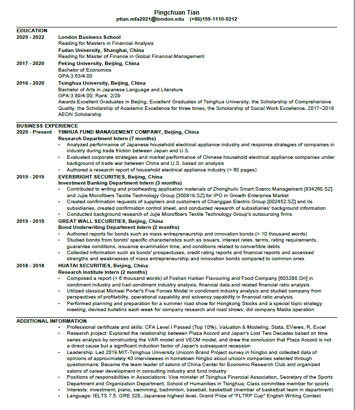

```{r load-libraries, warning=FALSE, message=FALSE, echo=FALSE}
library(tidyverse)  # Load ggplot2, dplyr, and all the other tidyverse packages
library(gapminder)  # gapminder dataset
library(here)
```

## CV of Pingchuan Tian


## Biography of Pingchuan Tian
   
My name is Pingchuan Tian, and I graduated from Tsinghua University, majoring in __Japanese__. And I also double majored in __Economics__ in Peking University. I am an easygoing boy from __Ningbo__, a coastal city in China.You can learn more about my hometown at <https://wikitravel.org/en/Ningbo>

I have various hobbies.

My hobbies:

* swimming
* playing basketball
* playing badminton
* investment
* playing the piano

But the one that deeply fascinates me is investment. I love investing in the stock market and purchasing funds. That is also the reason that I join the MFA program in LBS.

Although I am not a learning genius, I think studying is a pleasure and it can elevate my comprehensive quality. However, I don’t like exam that much. I am a perfectionist, so sometimes I also feel some pressure. In my spare time, I usually play badminton or play the piano. I believe these are good ways to release the pressure.

The study in LBS is undergoing, and I can’t wait seeing you guys in the beautiful campus! I believe we can become good friends and I am looking forward to our future journey in LBS.
